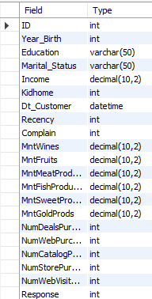
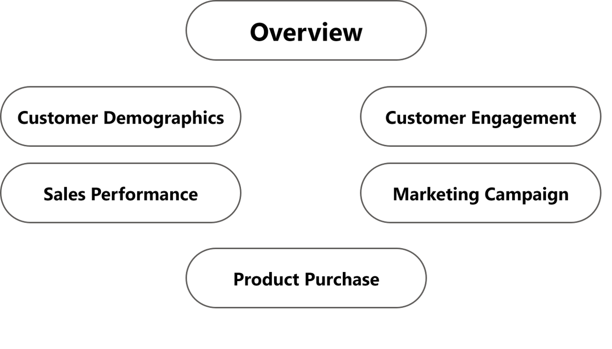
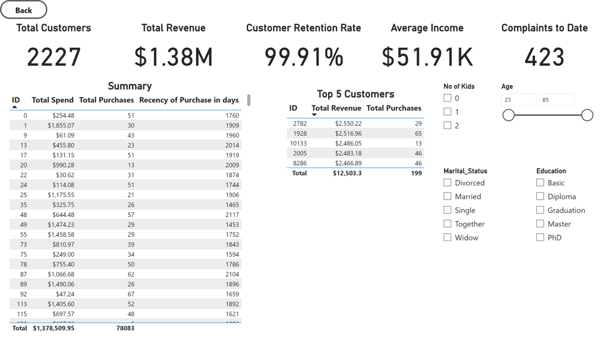
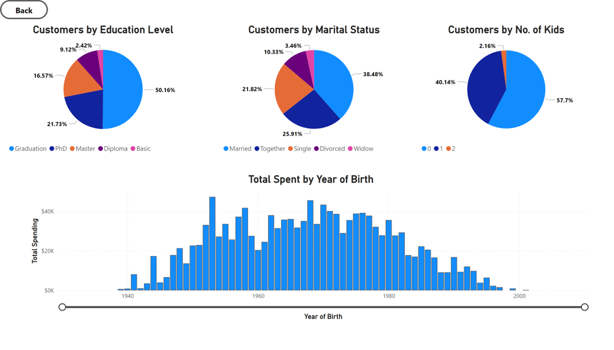
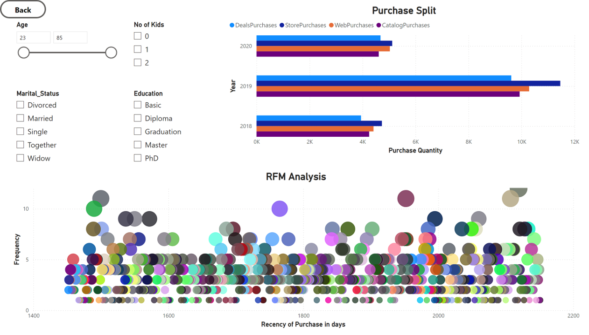
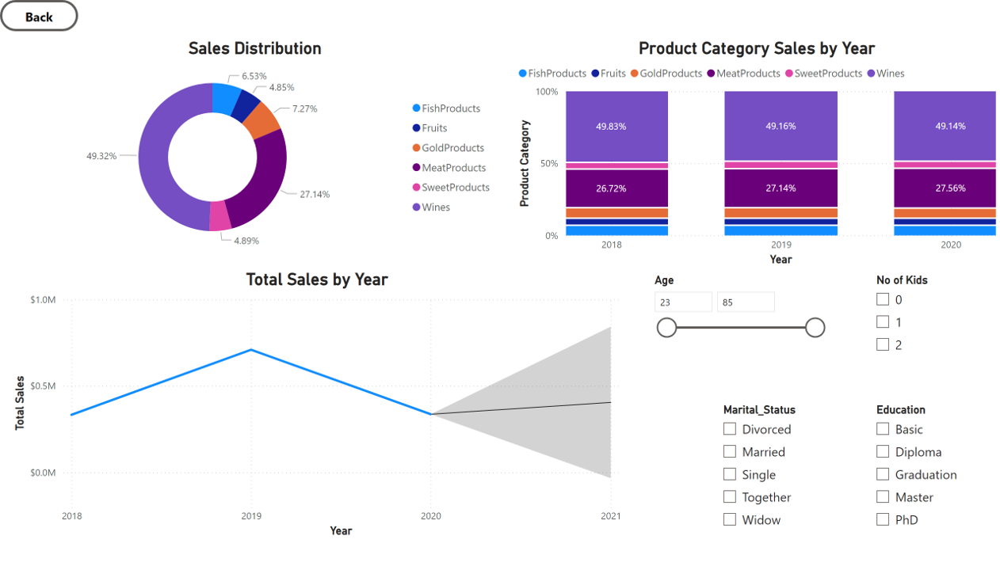
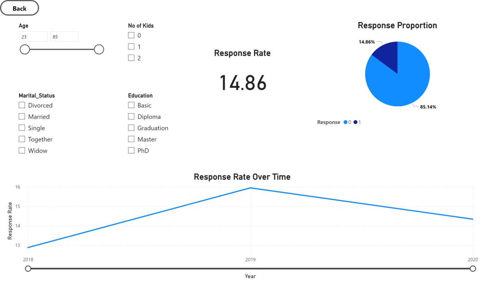
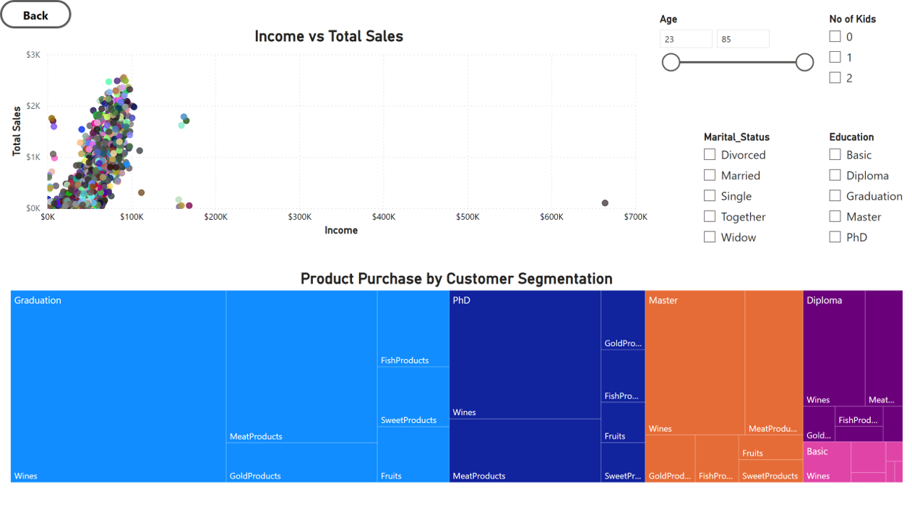
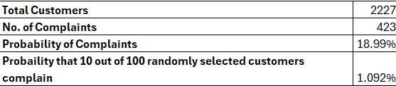

# Supply Chain Analytics: A Comprehensive Approach


# Table of Contents

- [Objective](#objective)
  - [User Story](#user-story)
  - [Target Audience](#target-audience)
  - [Data Source](#data-source)
- [Stages](#stages)
- [Design](#design)
  - [DashBoard Mockups](#dashboard-mockups)
  - [Tools Used](#tools-used)
- [Development](#development)
  - [Pseudocode](#pseudocode)
  - [Data Exploration Notes](#data-exploration-notes)
- [Data Cleaning and Testing](#data-cleaning-and-testing)
  - [Transform and Test the Data](#transform-and-test-the-data)
- [Visualisation](#visualisation)
  - [Results](#results)
  - [DAX Measures](#dax-measures)
- [Analysis](#analysis)
  - [Findings](#findings)
- [Recommendations](#recommendations)
- [Action Plan](#action-plan)
- [Key Performance Indicators (KPIs) and Monitoring Methods](#key-performance-indicators-kpis-and-monitoring-methods)
- [Conclusion](#conclusion)


# Objective

The main objective of this project is to use analytical techniques to gather insights to ensure seamless flow of products from suppliers to stores. The objectvies can be outlines as follows:

1. Segment customers based on purchasing behavior and demographics to identify the most profitable segments.
2. Identify factors influencing customer spending and predict future spending patterns.
3. Optimize inventory levels to maximize profit and minimize costs while meeting customer demand.
4. Test hypotheses regarding spending behaviors among different customer groups.
5. Identify trends and seasonal patterns in customer purchasing behavior over time.
6. Improve customer retention rates by identifying factors leading to churn.

## User Story

As the Supply Chain Manager, I want to apply various analytical techniques to our customer data so that we can derive insights and support decision-making processes for improving our supply chain operations. I need probability calculations, hypothesis testing, regression modeling, and linear programming to provide actionable recommendations for our upcoming sales and operations planning meeting.

## Target Audience

1. General Manager
2. Supply Chain Manager
3. Sales Manager
4. Operations Manager
5. Procurement Manager

## Data Source

The data for this analysis has been obtained from a confidential source and mimics real-time events, names, products, and places. It has been synthesized to mask the original source.


# Stages

- Design
- Development
- Testing
- Analysis
- Reccomendations


# Design

Based on the requirements, we can create dashboards that contain the following components, enabling the stakeholders to make informed decisions about their supply chain:
1. Overview Section
2. Customer Demographics Overview
3. Sales Performance Dashboard
4. Product Purchase Analysis
5. Customer Engagement Dashboard
6. Marketing Campaign Response
7. Interactive Filters and Drill downs


## DashBoard Mockups

What should the Dashboard Look like?

Some of the data visuals that may be appropriate in answering our questions include:

1. Table
2. Bar Chart
3. Line Chart
4. Scatter Plot
5. Text Box
6. KPI Card
7. Slicers


## Tools Used

| **Tool** | **Purpose** |
| --- | --- |
| Excel | Exploring and analyzing the data |
| MySQL Server | Cleaning and testing the data |
| Power BI | Visualizing the data via interactive dashboards |
| GitHub | Hosting the project documentation |


# Development

## Pseudocode

## Pseudocode

- How can we approach the problem to create a solution from start to finish?

  1. Get the data from a reliable data source
  2. Explore the data in Excel to check for any errors that standout
  3. Load the data into SQL Server
  4. Clean the data with SQL
  5. Test the data with SQL
  6. Load the clean data into PowerBI
  7. Generate visualisations of the data in PowerBI
  8. Perform Analysis using Excel 
  9. Generate the findings based on the insights
  10. Write the documentation + commentary
  11. Publish the insights generated
 
## Data exploration notes

This is the stage where we scan the data for errors, inconcsistencies, bugs, weird and corrupted characters etc.

- The initial observations with this dataset are as follows:

  1. The dataset comprises customer demographic and transaction data, containing 21 columns and multiple records. Key columns include customer ID, year of birth, education level, marital status, income, number of children, and various spending categories.
  2. There are no immediate indications of missing values in the dataset, suggesting a complete dataset. However, a thorough check is necessary.
  3. The dataset includes detailed demographic information such as age (derived from year of birth), education level, and marital status.
  4. Various spending categories are tracked, including wines, fruits, meat products, fish products, sweet products, and gold products.
  5. Details on customer complaints and their response to campaigns are recorded, which can be useful for customer satisfaction and engagement analysis.
  6. Although not explicitly about logistics, the dataset can provide insights into inventory management by analyzing spending patterns and purchase frequencies.
  7. Outliers exist in numerical columns such as income, spending amounts, number of purchases, and recency. These outliers require further analysis to decide whether to cap, remove, or treat them in another manner.


# Data Cleaning and Testing

The aim is to refine the dataset to ensure it is structured and ready for analysis. The cleaned data should meet the following criteria and constraints:

1. Only relevant columns should be retained.
2. All data types should be appropriate for the contents of each column.
3. No column should contain null values, indicating complete data for all records.

Below is a table outlining the constraints on our cleaned dataset,

| **Tool** | **Purpose** |
| --- | --- |
| Number of Rows | 2241 |
| Number of Columns | 18 |

## Expected Schema for Clean Data

| **Column Name**      | **Data Type**   | **Description**                                      |
|----------------------|-----------------|------------------------------------------------------|
| `CustomerID`         | `INT`           | Unique identifier for the customer                   |
| `Year_Birth`         | `INT`           | Year of birth of the customer                        |
| `Education`          | `VARCHAR(50)`   | Highest education level attained by the customer     |
| `Marital_Status`     | `VARCHAR(50)`   | Marital status of the customer                       |
| `Income`             | `DECIMAL(10,2)` | Annual income of the customer                        |
| `Kidhome`            | `INT`           | Number of children in the customer's household       |
| `Dt_Customer`        | `DATETIME`      | Date when the customer was enrolled                  |
| `Recency`            | `INT`           | Number of days since the last purchase               |
| `Complain`           | `INT`           | Whether the customer has made a complaint (0 or 1)   |
| `MntWines`           | `DECIMAL(10,2)` | Amount spent on wines                                |
| `MntFruits`          | `DECIMAL(10,2)` | Amount spent on fruits                               |
| `MntMeatProducts`    | `DECIMAL(10,2)` | Amount spent on meat products                        |
| `MntFishProducts`    | `DECIMAL(10,2)` | Amount spent on fish products                        |
| `MntSweetProducts`   | `DECIMAL(10,2)` | Amount spent on sweet products                       |
| `MntGoldProds`       | `DECIMAL(10,2)` | Amount spent on gold products                        |
| `NumDealsPurchases`  | `INT`           | Number of purchases made with a discount             |
| `NumWebPurchases`    | `INT`           | Number of purchases made through the web             |
| `NumCatalogPurchases`| `INT`           | Number of purchases made using a catalog             |
| `NumStorePurchases`  | `INT`           | Number of purchases made directly in stores          |
| `NumWebVisitsMonth`  | `INT`           | Number of visits to the company’s website in the last month |
| `Response`           | `INT`           | Whether the customer responded to a campaign (0 or 1)|

- Steps taken to clean and shape the data into the desired format

  1. Convert Date Columns to Datetime Format
  2. Check for missing values
  3. Handle outliers
  4. Standarise data types
  5. Revalidate data types

## Transform and test the data

Before data transformation, a new database is created in the MySQL server. After the database is created, the raw data file is imported into the server using the table import wizard. After the import is complete, we can now being cleaning the data.

### Convert Date Columns to DateTime format
```sql
ALTER TABLE customers_data MODIFY COLUMN Dt_Customer DATETIME;
```

### Check for Missing Values and Outliers
```sql
SELECT column_name, COUNT(*) - COUNT(column_name) AS missing_count
FROM customer_data
GROUP BY column_name;
```
This step is repeated for multiple columns to check for any missing values and outliers

### Handle Outliers
```sql
-- Update the Education column to change '2n Cycle' to 'Diploma'
UPDATE customers_data
SET Education = 'Diploma'
WHERE Education = '2n Cycle';


-- Update the Education column to change '2n Cycle' to 'Diploma'
UPDATE customers_data
SET marital_status = 'Single'
WHERE marital_status = 'YOLO' or marital_status ='Absurd' or marital_status ='Alone';

-- Delete rows with negative values in the Income column
DELETE FROM customers_data
WHERE Income < 0;

-- Update the MntWines column to change negative values to positive values
UPDATE customers_data
SET MntWines = ABS(MntWines)
WHERE MntWines < 0;

-- Update the MntFruits column to change negative values to positive values
UPDATE customers_data
SET MntFruits = ABS(MntFruits)
WHERE MntFruits < 0;

-- Update the MntMeatProducts column to change negative values to positive values
UPDATE customers_data
SET MntMeatProducts = ABS(MntMeatProducts)
WHERE MntMeatProducts < 0;

-- Update the MntFishProducts column to change negative values to positive values
UPDATE customers_data
SET MntFishProducts = ABS(MntFishProducts)
WHERE MntFishProducts < 0;

-- Update the MntSweetProducts column to change negative values to positive values
UPDATE customers_data
SET MntSweetProducts = ABS(MntSweetProducts)
WHERE MntSweetProducts < 0;

-- Update the MntGoldProds column to change negative values to positive values
UPDATE customers_data
SET MntGoldProds = ABS(MntGoldProds)
WHERE MntGoldProds < 0;

-- Update the NumDealsPurchases column to change negative values to positive values
UPDATE customers_data
SET NumDealsPurchases = ABS(NumDealsPurchases)
WHERE NumDealsPurchases < 0;

-- Update the NumWebPurchases column to change negative values to positive values
UPDATE customers_data
SET NumWebPurchases = ABS(NumWebPurchases)
WHERE NumWebPurchases < 0;

-- Update the NumCatalogPurchases column to change negative values to positive values
UPDATE customers_data
SET NumCatalogPurchases = ABS(NumCatalogPurchases)
WHERE NumCatalogPurchases < 0;

-- Update the NumStorePurchases column to change negative values to positive values
UPDATE customers_data
SET NumStorePurchases = ABS(NumStorePurchases)
WHERE NumStorePurchases < 0;

-- Update the NumWebVisitsMonth column to change negative values to positive values
UPDATE customers_data
SET NumWebVisitsMonth = ABS(NumWebVisitsMonth)
WHERE NumWebVisitsMonth < 0;

-- Change column name for ID column
Alter table customers_data
Change Column ID ID INT;
```

### Standardise the datatypes
```sql
ALTER TABLE customers_data
MODIFY COLUMN ID INT,
MODIFY COLUMN Year_Birth INT,
MODIFY COLUMN Education VARCHAR(50),
MODIFY COLUMN Marital_Status VARCHAR(50),
MODIFY COLUMN Income DECIMAL(10,2),
MODIFY COLUMN Kidhome INT,
MODIFY COLUMN Recency INT,
MODIFY COLUMN Complain INT,
MODIFY COLUMN MntWines DECIMAL(10,2),
MODIFY COLUMN MntFruits DECIMAL(10,2),
MODIFY COLUMN MntMeatProducts DECIMAL(10,2),
MODIFY COLUMN MntFishProducts DECIMAL(10,2),
MODIFY COLUMN MntSweetProducts DECIMAL(10,2),
MODIFY COLUMN MntGoldProds DECIMAL(10,2),
MODIFY COLUMN NumDealsPurchases INT,
MODIFY COLUMN NumWebPurchases INT,
MODIFY COLUMN NumCatalogPurchases INT,
MODIFY COLUMN NumStorePurchases INT,
MODIFY COLUMN NumWebVisitsMonth INT,
MODIFY COLUMN Response INT;
```

### Revalidate the data types
```sql
DESCRIBE customers_data;
```



Now that the data is cleaned, we can perform a series of checks to ensure data validity, consistency and correctness. Some of the tests performed on this dataset are as follows:

1. Check for Null Values
2. Check for negative values
3. Check for consistency in categorical data
4. Check for logical consistency
5. Check for duplicates

### Ensure no Null Values
```sql
SELECT COUNT(*) AS NullCount
FROM customers_data
WHERE ID IS NULL
   OR Year_Birth IS NULL
   OR Education IS NULL
   OR Marital_Status IS NULL
   OR Income IS NULL
   OR Kidhome IS NULL
   OR Dt_Customer IS NULL
   OR Recency IS NULL
   OR Complain IS NULL
   OR MntWines IS NULL
   OR MntFruits IS NULL
   OR MntMeatProducts IS NULL
   OR MntFishProducts IS NULL
   OR MntSweetProducts IS NULL
   OR MntGoldProds IS NULL
   OR NumDealsPurchases IS NULL
   OR NumWebPurchases IS NULL
   OR NumCatalogPurchases IS NULL
   OR NumStorePurchases IS NULL
   OR NumWebVisitsMonth IS NULL
   OR Response IS NULL;
```

### Check for Negative Values
```sql
SELECT COUNT(*) AS NegativeCount
FROM customers_data
WHERE Income < 0
   OR MntWines < 0
   OR MntFruits < 0
   OR MntMeatProducts < 0
   OR MntFishProducts < 0
   OR MntSweetProducts < 0
   OR MntGoldProds < 0
   OR NumDealsPurchases < 0
   OR NumWebPurchases < 0
   OR NumCatalogPurchases < 0
   OR NumStorePurchases < 0
   OR NumWebVisitsMonth < 0;
```

### Check for Consistency in Categorical Data
```sql
-- Check distinct values in Education column
SELECT DISTINCT Education
FROM customers_data;

-- Check distinct values in Marital_Status column
SELECT DISTINCT Marital_Status
FROM customers_data;
```

### Check for Logical Consistency
```sql
SELECT ID, (YEAR(CURDATE()) - Year_Birth) AS Age
FROM customers_data
WHERE (YEAR(CURDATE()) - Year_Birth) < 0
   OR (YEAR(CURDATE()) - Year_Birth) > 100;
```

### Check for Duplicates
```sql
SELECT ID, COUNT(*) AS DuplicateCount
FROM customers_data
GROUP BY ID
HAVING COUNT(*) > 1;
```

We can now export this cleaned data into PowerBI to create visualisations.

# Visualisation

## Results

- What does the Dashboard look like?
  Below is a link to access the dashboard

  [PowerBI Dashboard](https://app.powerbi.com/view?r=eyJrIjoiYTg2NDA1ZGEtZTIwYS00NGMyLTg4ODItMTEwNDNhODYzYzQ0IiwidCI6IjhkMWQzMjI3LWRhMjAtNGQ5ZS1iMGE1LTZiNWU4MzAzZDI4YyJ9)

  The dashboard has been created with 6 different pages and an additional navigation pane. Here are the visuals for each of the pages:

  ### Navigation Pane

  

  ### Overview

  

  ### Customer Demographics

  

  ### Customer Engagement

  

  ### Sales Performance

  

  ### Marketing Campaign

  

  ### Product Purchase

  

  ## DAX Measures

  - A few simple DAX measures have been used to ease the process of generating visualisations

  ### Age
  ```sql
  Age = YEAR(TODAY())-[Year_Birth]
  ```

  ### Repeat Customers
  ```sql
  Repeat Customers = CALCULATE(DISTINCTCOUNT('Cleaned data from SQL'[ID]), 'Cleaned data from SQL'[NumStorePurchases] > 1 || 'Cleaned data from SQL'[NumWebPurchases] > 1 || 'Cleaned data from SQL'[NumCatalogPurchases] > 1)
  ```

  ### Customer Retention Rate
  ```sql
  Customer Retention Rate = DIVIDE([Repeat Customers],[Total Customers],0)
  ```

  ### Recency of Purchase
  ```sql
  Recency of Purchase = DATEDIFF(('Cleaned data from SQL'[Dt_Customer]),TODAY(),DAY)
  ```

  ### Total Purchases
  ```sql
  Total Purchases = SUM('Cleaned data from SQL'[NumCatalogPurchases]) + SUM('Cleaned data from SQL'[NumStorePurchases]) + SUM('Cleaned data from SQL'[NumWebPurchases]) + SUM('Cleaned data from SQL'[NumDealsPurchases])
  ```

  ### Total Responses
  ```sql
  Total Responses = CALCULATE(COUNT('Cleaned data from SQL'[Response]),'Cleaned data from SQL'[Response] = 1)
  ```

  ### Total Sales
  ```sql
  Total Sales = [MntFishProducts] + [MntFruits] + [MntGoldProds] + [MntMeatProducts] + [MntSweetProducts] + [MntWines]
  ```

# Analysis

Now that we have cleaned and tested the data using SQL, we can take a deeper dive into the data with the help of Excel Solver add-in to gather insights and to strategise performance improvement opportunities.

## Probability

What is the probability that for at most 10 out of 100 randomly selected customers to have complained within the last two years?
- To calculate the probability, we make use of the below Excel Function,
  ```sql
  BINOM.DIST(10,100,Z6,TRUE)
  ```
The result from the Excel is shown below,



The 1.092% probability suggests that the complaints are relatively rate. This indicates that the customer satisfaction is generally high. Further investigation into the reasons for the complaints can help improve customer satisfaction even more.

Actions to be taken:
- Continue monitoring customer feedback and complaints.
- Implement proactive measures to maintain or improve customer satisfaction.


  
  


